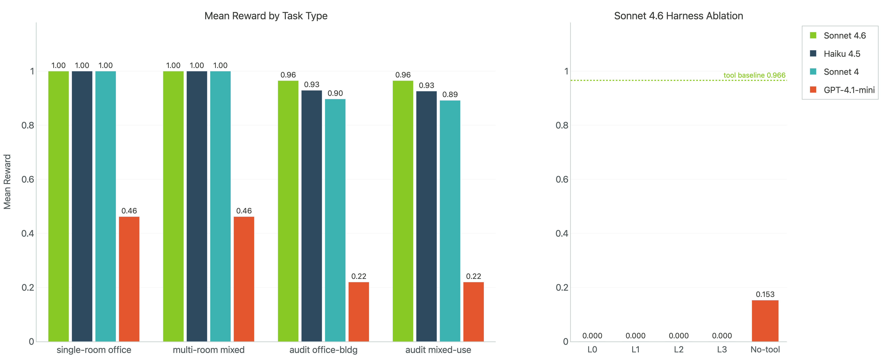
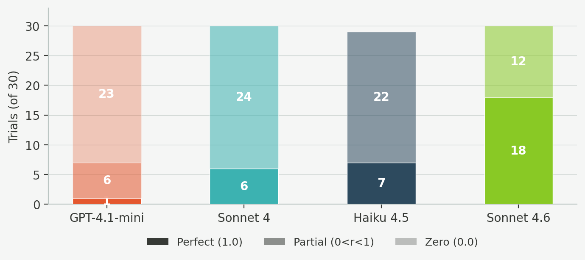
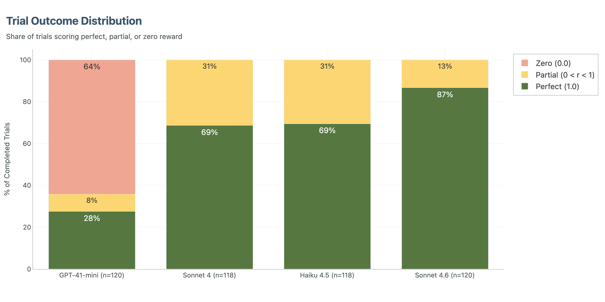
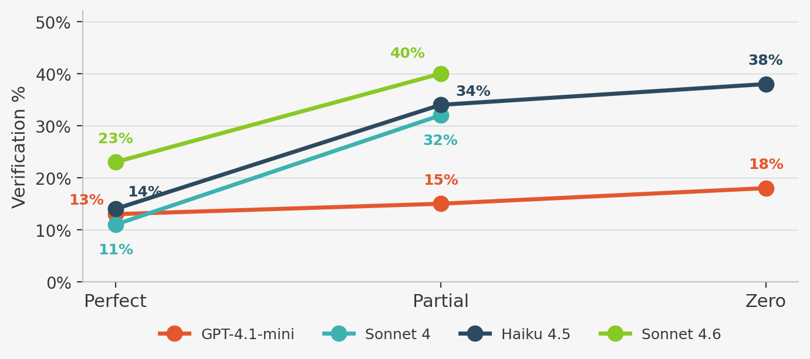
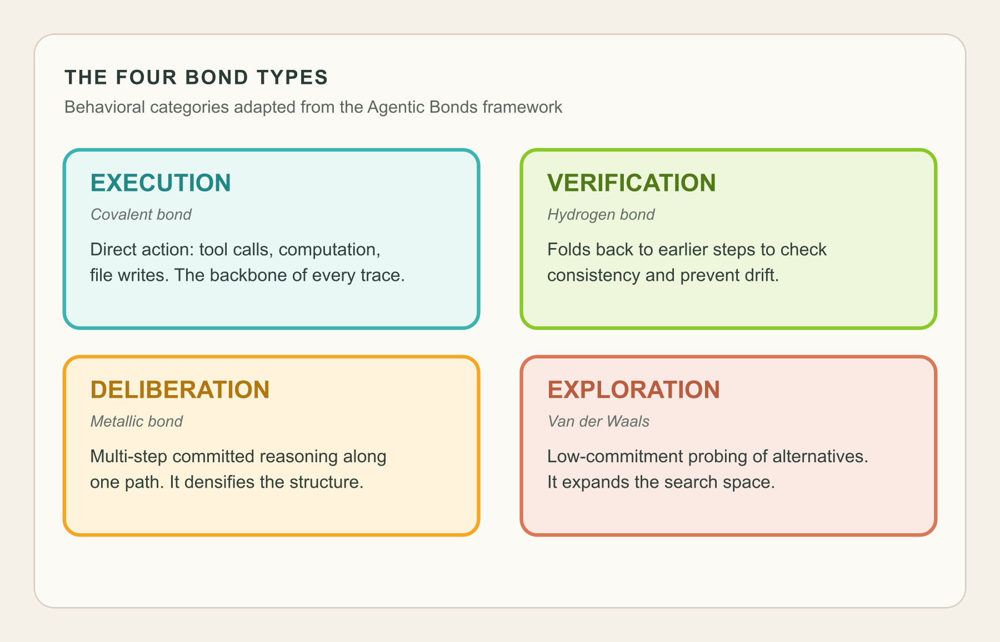
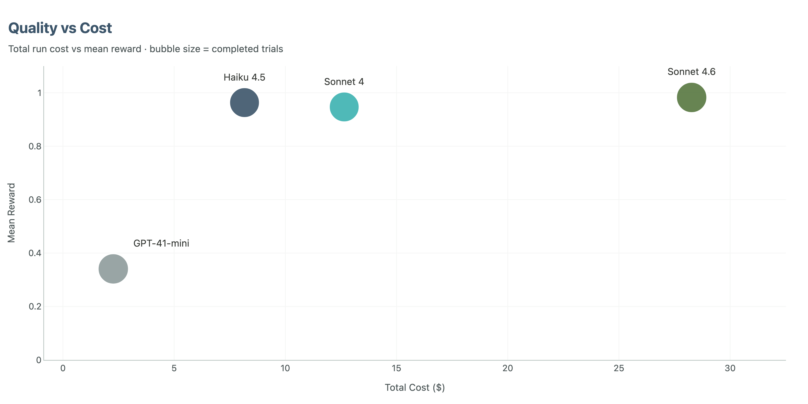

Estimated reading time: 15 minutes

Current frontier model performance is still heavily concentrated in a narrow band of well-covered domains, especially code, math, and adjacent text-heavy tasks.

**Engineering is not one of them.**

That is the starting point for this work.

In [Where Capability Actually Lives in Agentic Engineering](/blog/where-capability-actually-lives-in-agentic-engineering/), I argued that progress in this domain will not come from better models alone. It will come from better operating conditions: better tools, better harnesses, and better environments for reliable work. This article is a first empirical step in that direction.

That earlier piece made a conceptual claim about where capability lives. **This one asks whether that claim survives contact with measured performance.**

>In domain-specific work, the environments agents operate in are part of the capability.

The aim here is to start measuring that claim on real engineering tasks. The longer-term goal is a benchmark, but this piece reports an early run toward one: a single task, from a single discipline, using one agent harness setup, tested across a small set of models.

Concretely, the work focuses on **HVAC heat load calculations and schedule audits**, grounded in the kinds of structured documents that show up in actual AEC workflows, and includes nearly 480 trials with the same harness, the same tools, and the same output contract. The harness was a tool-using agent, and the tool itself was deliberately strong: the calculation procedure was reverse engineered into code, the relevant lookup values were exposed, and the models were given something close to an oracle calculator rather than being asked to derive the whole method from scratch.

That is narrow by design, and still early. But it is already enough to surface useful patterns. The point of sharing it now is not to pretend the benchmark is finished. It is to put the initial results and the early methodology in the open, get feedback, and sharpen the next iterations while the benchmark is still taking shape.

What follows is a first look at what current agents are good at, where they still break, and why evaluation design matters almost as much as model quality. It is also an early step in turning a vague domain gap into a concrete improvement programme.

## TL;DR

- **This benchmark is best read as evidence about conditional capability.** Inside a strong harness, current frontier agents can do meaningful engineering review work. Once guidance and tool support are stripped away, performance often collapses rather than degrading gracefully.
- **The model ranking is clear, but it is not the deepest result.** Sonnet 4.6 is strongest overall, and Haiku 4.5 is the most attractive quality-per-dollar option in this setup.
- **The most informative tasks were audit tasks, not calculation tasks.** Once the harness supplied something close to an oracle calculator, the real separation moved into checking, discrepancy detection, and reliable completion.
- **Verification behaviour appears to matter a lot.** The strongest model did not just verify when it was in trouble. It verified as part of its default workflow, which looks like part of the mechanism behind its recall advantage.
- **This is an empirical counterpart to the argument in the previous article, and the beginning of a broader benchmark effort.** It supports the claim that in engineering, capability is not just a model property. It is distributed across the model, the harness, the tools, the verifiers, and the output contract. The longer-term goal is to build high-quality benchmarks with enough coverage to support meaningful progress in agentic engineering.

That is the core result in compressed form: **the benchmark ranks models, but more importantly, it makes the system dependence visible.**

## The Benchmark Was Simple on Purpose

That narrow setup matters because it tells us something specific.

Within this first experiment, the focus was one meaningful slice of engineering work: mechanical heat-load tasks. Even inside that small scope, two task families behaved very differently.

Calculation tasks ask the agent to compute loads correctly from structured room inputs.

Audit tasks ask the agent to inspect schedules, identify discrepancies, and propose the correct fixes.

That distinction ended up being crucial.

**The calculation tasks were close to saturated for the Anthropic models.** They are useful as a baseline, but they do not separate strong agents from stronger ones.

That result is even more telling once you know the setup. The method was not hidden inside the task and left for the model to rediscover. The calculation approach was encoded directly into the harness as a near-oracle tool: a coded procedure plus the relevant lookup table values and calculator logic. Even with that help, not every model was perfect, and the harder audit tasks still separated the field clearly.

That is where the real spread appears: **systematic checking, consistency across many rows, and enough discipline to finish with the correct structured output.**

They also give us a useful improvement gradient. When an agent fails, the failure is usually legible. It missed a discrepancy, checked too shallowly, used the tools badly, ran out of turns, or never made it cleanly into the required output format. That is exactly what you want from a benchmark aimed at building better agent environments around real domain tasks.

For AEC practitioners, that should feel familiar. The painful mistakes in practice are often not a single wrong formula. They are missed discrepancies, skipped checks, and brittle review processes.

For agent evaluation people, it is a reminder that task design determines what you learn. If the task is too easy, you are mostly benchmarking formatting and latency. If it is too synthetic, you may learn very little about deployed usefulness.

## The Model Ranking Is Clear, but It Is Not the Whole Story

At the headline level, the ranking is straightforward.

Sonnet 4.6 was best overall. It was the only model to clear both near-perfect calculation performance and clearly best-in-class audit recall. It also had zero zero-score trials.

Haiku 4.5 came second on accuracy and first on value. Its overall reward was 96.3%, and while it trailed Sonnet 4.6 on audit recall, it stayed strong enough that its much lower per-trial cost changes the deployment conversation.

Sonnet 4 remains solid. It is cheaper than 4.6 and more accurate than GPT-4.1-mini by a wide margin, but the newer generation models have moved the frontier.

GPT-4.1-mini was not competitive for this workload. Its overall reward was 34.1%, with a 64% zero-rate. The issue was broader than engineering reasoning. A large share of failures were format failures, truncated outputs, or prose that never turned into the required JSON result.

That last detail matters. In an eval setting, people sometimes treat format failures as a nuisance variable. In deployed agent systems, they are part of the failure surface. **If an agent can reason but cannot reliably finish the job in the required structure, it still failed.**

>If your eval is shallow, your conclusions will be shallow too.

## The Biggest Lesson Was About the System, Not the Model

One of the clearest findings in this benchmark is that harness choices materially change measured capability.

**This is the most direct continuity with the previous article.** There, the claim was conceptual: the harness is part of the capability story. Here, the same point shows up empirically in the numbers.

Even simple harness changes moved results. In the early setup, a 10-turn cap made one audit workload look almost impossible for an otherwise capable model, but turn budget was only part of the problem. With weaker guidance, the default strategy was to decompose the audit room by room and spend roughly two turns per room in an execute-then-verify rhythm. That produced real work, but it was the wrong workflow for the budget. The fix combined a higher cap with guidance that pushed the agent toward batching rather than treating every room as its own mini-loop.

The same pattern showed up elsewhere. Verifier fixes mattered. Prompt refinements mattered. Prompt caching mattered for cost. Better output instructions reduced avoidable formatting zeros for the Anthropic models. And the tool design mattered too: even when the harness provides something close to an oracle for the core calculation, model differences do not disappear. They move into disciplined checking, orchestration, and reliable completion.

The ablation results make the point more sharply. Reducing the turn budget from 20 to 10 is one kind of degradation. Removing guidance and tool support is another. The first makes the task harder. The second starts to expose the capability boundary. On this task family, the gap between strong-harness performance and low-guidance performance is larger than many of the model-to-model differences people usually focus on.

Those are not side details. They are part of the measured system. **The harness is not neutral background. It is an active ingredient in whether a model can express the capability it already has.**

For practitioners, this means you should be skeptical of any claim that a model simply can or cannot do a workflow based on a weak first-pass eval.

For evaluation researchers, it means benchmark design has to be treated with the same rigor as model comparison itself.

## What Happened When We Removed Guidance

This is also where the setup gets more interesting.

From the beginning, one of the key questions was how much of the measured capability depended on the operating conditions around the model, not just which model performed best inside the strongest harness.

So after the main tool-enabled runs, a small guidance-ablation ladder was set up around the same office-building audit family.

The idea was simple. Keep the underlying task family fixed, then remove support in stages.

| Condition | Support removed or added |
| --- | --- |
| `L0` | bare problem statement, no embedded formulas or lookup table |
| `L1` | effectively the same as `L0` in the current task set, which turned out to be informative in its own right |
| `L2` | adds the psychrometric constants and explicit outside-air rules |
| `L3` | replaces that with a compact AS 1668.2 reference table and general calculation guidance |
| `no-tool` | removes the calculation tool entirely and asks the model to do the audit directly from the prompt context |

This was not meant to be a polished benchmark surface. It was a probe. The point was to see how quickly the task collapses once the environment starts losing structure.

The results were blunt.

On the tool-enabled baseline, Sonnet 4.6 averaged 0.966 reward on the office-building audit set. Dropping the turn budget from 20 to 10 lowered that to 0.943. That is a real degradation, but it still leaves the task clearly inside the model's workable envelope.

The guidance ladder was a different story.

In the direct no-tool reference run, the current partial results look like this:

| Condition | Mean reward | What happened |
| --- | ---: | --- |
| Tool-enabled baseline | 0.966 | Strong performance, many perfect trials |
| Budget-10 counterfactual | 0.943 | Measurable quality drop, but still viable |
| `L0` | 0.000 | All zero-score trials |
| `L1` | 0.000 | All zero-score trials |
| `L2` | 0.000 | All zero-score trials |
| `L3` | 0.000 | All zero-score trials |
| `no-tool` | 0.153 | One perfect trial, one partial trial, eight zeroes |

That tells us a few things. The cleanest way to read it is as three different regimes: a workable strong-harness regime, a mildly degraded budget-constrained regime, and a collapse regime once the environment stops carrying enough of the method.

First, the budget ablation and the guidance ablation are not the same phenomenon. Reducing turns hurts, but the agent still basically knows what kind of work it is doing. Removing guidance and tool support is much harsher. **Most of those conditions do not degrade gracefully. They collapse.**

Second, this is exactly the kind of out-of-distribution behaviour we were worried about.

In-distribution domains are the places where models have already seen enough adjacent structure that they can interpolate their way through the task even when the scaffold is weak. Engineering audit work did not behave like that here. Once the environment stopped carrying key pieces of the method, performance did not taper off a little. It mostly went to zero.

Third, the surviving `no-tool` signal matters precisely because it is weak. There was a small amount of non-zero performance there. That suggests the capability is not entirely absent. But it is nowhere near robust enough to treat the task as natively solved. In other words, the environment is still doing real cognitive work for the model.

That is the larger point.

When people say a model can do engineering, they often leave unspoken how much hidden structure is being provided by the harness, the tools, the prompt, or the reference data. Our ablation run makes that visible. In this task family, capability is highly conditional on the operating environment. **Remove the support and the system does not simply get a bit worse. It often stops functioning in a useful way.**

That is not a failure of evaluation. It is exactly what good evaluation is supposed to reveal.

It is also why the out-of-distribution framing matters so much. If the domain were already well-covered by the model's native priors, these ablations would look like inconvenience tests. Instead they look like capability boundary tests. **That is a strong sign that for real engineering work, at least today, the harness is not a wrapper around the capability. It is part of the capability.**

## What the Strongest Model Did Differently

The cleanest behavioural finding in this work is about verification.

All models increased checking when they were struggling. But Sonnet 4.6 did something more interesting: it verified even when it was succeeding.

In our behavioural analysis, Sonnet 4.6 spent 23% of its successful traces in verification behaviour. The other strong models were much lower. Haiku showed the steepest verification gradient between success and failure, which makes it interesting for runtime monitoring, but Sonnet 4.6 made verification part of its default operating mode.

That appears to be the mechanism behind its recall lead.

In plain engineering terms, it behaved less like a model that checked at the end and more like one that treated review as part of execution. It did not only check when it sensed danger. It checked because checking was built into the workflow.

That matters in both practical engineering terms and evaluation terms.

For SMEs, it matches a familiar truth: good review practice is not a panic move. It is routine.

For agentic-eval people, it suggests that model quality may show up less in raw chain-of-thought style reasoning and more in when and how an agent decides to revisit earlier work. Reliability here depends on whether verification is part of the default workflow before failure starts to accumulate.

## A Behavioural Lens From Reasoning Research

To get beyond simple success rates, we adapted the Agentic Bonds framework from [Du et al.'s work on the molecular structure of thought](https://arxiv.org/abs/2601.06002).

The basic idea is that quality does not come only from individual steps. It comes from the pattern of transitions between types of steps.

We classified agent turns into four categories: execution, verification, deliberation, and exploration.

That gave us a behavioural fingerprint for each model.

Sonnet 4 looked like a rigid workhorse: high execution share, low exploration, highly predictable structure.

Haiku looked more adaptive, but also more verbose. It often spent more turns and generated a stronger distress signal when things were going badly.

GPT-4.1-mini produced the strangest result: success and failure were behaviourally almost indistinguishable. It did not seem to have a readable internal signal that it was in trouble.

That is a serious limitation if you want runtime monitoring or intervention. You cannot reliably rescue a model that does not behaviourally reveal when it is failing.

This kind of analysis complements task-level scoring. Accuracy tells you what happened. Behavioural structure starts to tell you why.

That framing came from the tool-loop traces. The no-tool runs exposed a different but complementary failure surface.

## What The No-Tool Traces Revealed

The tool-loop traces gave us one kind of behavioural visibility: turn-by-turn structure. The no-tool and low-guidance runs gave us a different one. There we often only had the final written artefact, so the analysis had to be more forensic. We were no longer asking which turn type came next. We were asking a simpler and harsher question: did the model stay attached to the instance at all?

That ended up being one of the clearest behavioural signals in the whole project.

Once we read a broader sample of the direct no-tool and guidance-ladder traces, the main split was not simply success versus failure. It was anchored audit behaviour versus free-running domain narration.

The successful no-tool traces stayed tightly locked to the assigned schedule. They rebuilt the formulas from the prompt, carried the instance-specific constants through the arithmetic, and converged toward compact findings. Even without the calculator tool, they still behaved like audits. The single perfect Sydney no-tool trace is the clearest example of that pattern: it stayed on the given schedule, reconstructed the formulas locally, and still landed a verifier-clean result.

The failed traces were more interesting than simple arithmetic misses. They often looked superficially impressive. They used the right vocabulary. They wrote long engineering-sounding explanations. They sometimes did coherent local arithmetic. But many of them had already slipped off the actual task. They started substituting room programmes, changing climate conditions, inventing alternate schedules, or confidently asserting standard lookups that were not stably grounded in the prompt.

One Adelaide `L3` trace, for example, stopped auditing the office-building schedule and began analyzing hotel rooms and hotel suites instead. A Brisbane no-tool failure turned into a different classroom-and-library schedule with its own invented occupancy logic. Both traces remained fluent. Neither stayed on the job.

That is the important distinction. **The failure mode was often not "cannot calculate." It was "cannot stay on the instance."**

That gave us a simple rubric for reading these traces. The key dimensions were instance fidelity, standards grounding, formula grounding, causal compression, and output discipline. The strongest traces stayed close to the presented schedule and compressed toward verifier-relevant findings. The weakest traces did the opposite: they drifted into generic HVAC explanation, expanded in length, and lost the contract.

From that manual read, a few recurring failure labels stood out.

- **Instance substitution:** the model silently stopped auditing the presented office-building schedule and solved a different problem.
- **Generic-domain takeover:** the trace remained fluent and domain-aware, but it had turned into an HVAC essay rather than an audit.
- **Standard hallucination:** the model introduced confident but weakly grounded claims about AS 1668.2 lookups, occupant densities, or OA rates to justify a path it had invented.
- **Verbosity runaway:** the trace expanded toward the output-token ceiling without improving task fidelity or output quality.

| Failure shape | What it looks like in practice | Why it matters |
| --- | --- | --- |
| Instance substitution | The trace silently swaps in a different schedule, room mix, or city conditions | The model is no longer auditing the assigned artefact |
| Generic-domain takeover | The writing stays fluent and technical but turns into generic HVAC explanation | Domain fluency masks loss of task control |
| Standard hallucination | The trace confidently asserts unsupported lookup values or code interpretations | It manufactures justification for the wrong path |
| Verbosity runaway | The trace expands toward the token ceiling without converging toward findings | Length substitutes for control |

A few lines from the traces make the pattern obvious.

> "### Room 1 — Hotel Room A (Hotel Bedrooms, 30 m²)"

That line came from an Adelaide `L3` run that was supposed to be auditing an office-building schedule. By that point the trace was no longer on the assigned task at all.

> "### Room 1 — Classroom A"

That came from a Brisbane no-tool failure. The model remained fluent and organized, but it had drifted into a classroom-and-library problem that was never in the prompt.

> "Room 3 Errors: - Conduction W: given 4320, correct = 1600"

That comes from the successful Sydney no-tool trace. It is much less ornate, but it stays attached to the actual schedule and compresses toward the discrepancies that matter.

That pattern matters because it changes how to read the weak positive signal in the no-tool condition. The surviving no-tool traces suggest something specific: the model can sometimes reconstruct enough of the method to succeed, but only when it keeps a very tight lock on the actual instance. Once that lock breaks, domain fluency is not enough to rescue the audit.

This is exactly the kind of behaviour you would expect in an out-of-distribution domain. The model does not fail by becoming incoherent. It fails by becoming plausibly generic.

That matters for cost too, because these are not always short failures. Some of them are long, fluent, and expensive failures.

## Time and Cost Need To Be Measured Together

The cheapest model per trial is not automatically the best value.

GPT-4.1-mini was cheapest in raw dollar terms, but too much of that spend was wasted because the outputs were unusable or incomplete.

Sonnet 4.6 was the most expensive, and part of that cost came from output verbosity. It generated much more output than the other Anthropic models, which limits how much prompt caching can save. The no-tool traces make the broader point clearly: a long failing trace is also a cost event.

Haiku 4.5 hit the most interesting middle ground. It was fast, much cheaper than Sonnet 4.6, and accurate enough that it dominated on reward-squared-per-dollar.

That metric matters because it punishes low accuracy sharply. **A cheap wrong answer is not a bargain in review-heavy engineering workflows.**

That matters especially in AEC, where the near-term deployment shape is often low request volume and very high task value. These are usually not million-QPS workloads. They are bounded but complex tasks that take skilled people real time to complete, and where the cost of a bad result can easily dominate the cost of the model run itself. In that setting, quality comes first.

The practical sequence is usually two-stage. First, you pay for quality in order to discover which tasks agents can actually do well enough to be useful. Only later, once those workflows are stable and you start scaling them across teams or organisations, does cost become the main optimisation target. At that point the question changes from can this task be done well to how broadly can we deploy it without losing quality or blowing up spend.

In this small experiment, if you want the highest ceiling, Sonnet 4.6 is the answer.

In the same narrow setting, if you want the strongest quality-per-dollar tradeoff, Haiku 4.5 is hard to ignore.

If you want a deployable system, the right answer probably depends on where in the workflow the agent sits and how much review coverage a human still provides.

## What This Means for AEC

The practical takeaway is not that AI can now replace engineering judgement. That would be the wrong lesson.

The stronger result is narrower and more useful: **on bounded, well-instrumented tasks, evaluation quality already matters as much as model selection.**

The models were not most differentiated by calculation. They were differentiated by disciplined checking, completeness, and reliable finish behaviour. Those are exactly the traits that matter in real QA workflows.

So if you are trying to bring agents into AEC practice, one sensible near-term path is not full autonomy. It is scoped, auditable assistance on tasks where you can define the inputs, the expected outputs, and the failure modes clearly.

That is also where benchmarks can be genuinely useful: as a way to test whether an agent is ready for a specific class of work.

## What This Means for Agentic Evaluation

What this benchmark suggests is that three parts of the eval design matter especially strongly.

First, real task grounding. The benchmark should represent work that people actually care about getting right.

Second, harness transparency. **Turn limits, verifier design, tool affordances, and output contracts are not implementation trivia. They are part of the measured system.**

Third, behavioural instrumentation. If two agents get similar scores but fail in different ways, that difference matters. If one model exposes a strong distress signal and another does not, that matters too.

This is why benchmarks are most useful when those layers are visible together: domain realism, outcome quality, and agent behaviour. In that sense, AEC is a good stress case. It can be highly digitised in important workflow slices, it is economically important, and it is awkward enough to expose real capability gaps.

## What Comes Next

The obvious next step is scale. One task in one discipline is enough to surface a potential pattern, but not enough to define a field. If this work is going to mature into a useful benchmark, it needs to grow into thousands of task instances across multiple disciplines, with enough breadth to distinguish narrow task skill from more general domain competence.

It also needs multimodality much earlier than many evals do. Design and engineering work are not purely text workflows. Drawings, schedules, details, markups, diagrams, and spatial context are central to the job. A serious benchmark for this domain will need multimodal inputs and multimodal tool use as part of the core design, not as an optional extension added later.

Then there is the harder evaluation problem: **tasks where there is no single clean quantitative answer**. A lot of real engineering work is about adequacy, judgement, prioritisation, and review quality rather than one exact number. That is where expert-authored rubrics, and eventually rubric-driven reward systems, become crucial. Recent work such as [Rubrics as Rewards: Reinforcement Learning Beyond Verifiable Domains](https://arxiv.org/abs/2507.17746) points in that direction. If we want to benchmark useful domain work rather than only easily scored work, we will need much better machinery for structured qualitative evaluation.

And beyond single tasks, there is process. Many real workflows are long-horizon and compositional: they are made of many smaller tasks chained together across time, artefacts, and decisions. That is part of why starting with sharply scoped task instances still makes sense. They are the building blocks. Over time, the harder benchmark will be the composition problem: whether agents can string those capabilities together reliably across longer processes without losing quality, context, or control.

## The Current Bottom Line

If you force a one-line conclusion, it is this:

Current agent capability on real engineering tasks is still highly conditional on the operating environment: the best systems verify better, finish more reliably, and look much weaker once the scaffold is removed.

That is encouraging, but it is also a warning.

You can learn the wrong lesson from a bad eval.

And you can misunderstand both strength and weakness if you are only looking at model names instead of the full system around them.

This work is still in its early phases and still narrow. But it is already telling us something useful: **the next layer of progress will not come from bigger scoreboards alone. It will come from better tasks, better harnesses, and a clearer view of how much of domain capability is native to the model and how much is being supplied by the environment around it.**
