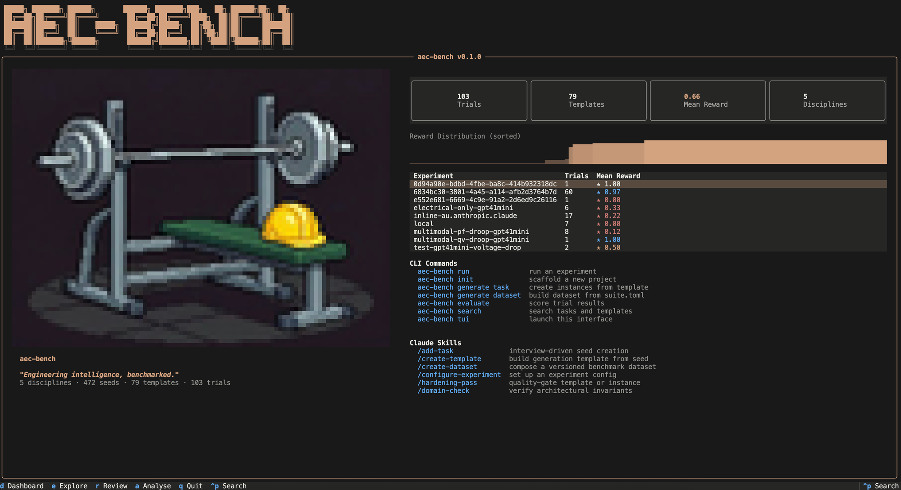

Estimated reading time: 5 minutes

There is a genre of LinkedIn post that goes something like this: "I gave GPT my floor plan and it produced a schedule in 30 seconds. The industry will never be the same."

It's a compelling demo but not much more than anecdotal evidence.

> The gap between a model producing a plausible-looking answer on a single prompt and actually performing reliably across a wide range of real engineering tasks is enormous. But we don't have the means to measure it.

I have written about this before. In [Where Capability Actually Lives](/blog/where-capability-actually-lives-in-agentic-engineering/), the argument was that in domain-specific work, performance is not a property of the model alone — it is distributed across the model, the tools, the verification, the orchestration, and the output contracts around it. In [Benchmarking Agents on Real Engineering Work](/blog/benchmarking-agents-on-real-engineering-work/), early empirical results supported that claim: when harness support was removed, capability didn't degrade gracefully. It collapsed. And in [What If the Harness Could Improve Itself?](/blog/what-if-the-harness-could-improve-itself/), we showed that automated improvement of the harness environment compounds in ways that model upgrades alone don't.

Those were arguments and early experiments. What we didn't have was a proper benchmark — one broad enough, multimodal enough, and rigorous enough to make the case at scale.

Now we do. Or at least a solid start at it.

## AEC-Bench

Together with [Nomic AI](https://www.nomic.ai/news/aec-bench-a-multimodal-benchmark-for-agentic-systems-in-architecture-engineering-and-construction), we have released [**AEC-Bench**](https://github.com/nomic-ai/aec-bench): the first multimodal benchmark for evaluating AI agents on real-world architecture, engineering, and construction tasks. It is open source under Apache 2.0, and it covers 196 task instances across three complexity levels, from single-sheet understanding to cross-document coordination across drawings, specifications, and RFIs.

Real documents, real decisions. The kind AEC professionals deal with every day: reading construction drawings, cross-referencing detail callouts, navigating sheet indices, reconciling specs with RFIs. Work where getting the gist doesn't cut it.

We evaluated multiple frontier agent configurations — including Claude Code (Opus 4.6, Sonnet 4.6), OpenAI Codex (GPT-5.2, GPT-5.4), and Nomic's domain-specific agent — across all three complexity tiers. The full results are in the paper, and they are worth reading. But the headline finding has nothing to do with which model scored highest.

**The headline finding is that the harness matters more than the model.**

## Retrieval Is the Bottleneck, Not Reasoning

Agents frequently fail before they get to the hard part — before any engineering judgment is required — because they cannot reliably locate the right sheet or the right cross-reference within a complex multimodal document set. Retrieval has to be embedded in the agent's logic and reasoning approach. Without the right harness, agents defaulted to treating rich construction drawings as flat text files via pdftotext, a fundamental mismatch with the structure and visual density of real AEC documents.

The model was fine. The harness was wrong.

But when equipped with domain-specific document parsing and retrieval, performance jumped dramatically. Gains of twenty to thirty points on the hardest task families, far exceeding what any model upgrade alone could deliver.

That's the empirical version of the claim I have been making for months: **in domain-specific work, the operating environment is part of the capability.**

## Benchmarks Are Not Leaderboards

This matters because it changes what benchmarks are for.

If you think a benchmark is a leaderboard — a place to crown a winner — then AEC-Bench tells you which agent configuration scored highest. Fine. But that is the least interesting thing it does.

The more important function of a benchmark like this is diagnostic. It tells you *where* the system breaks, *why* it breaks, and *what kind of intervention* would fix it. Retrieval matters more than reasoning on these tasks. Document understanding is a harder unsolved problem than calculation or code generation. And the difference between a model that scores 40% and a model that scores 70% might not be the model at all — it might be the tools it was given.

That diagnostic function is why the "it works on my example" style of evaluation is so dangerous. An anecdote has no control group. It has no complexity tiers. It does not distinguish between a model that got lucky on a simple case and a system that performs reliably across difficulty levels and task types. The anecdote tells you what happened once. The benchmark tells you what to expect, and more importantly, what to fix.

> If you want AI to work in engineering, stop collecting demos and start building benchmarks.

Benchmarks can ossify. They can reward gaming over genuine capability. But they're still the only tool that separates signal from anecdote.

For anyone building AI systems for AEC, or for any domain where the work is artifact-bound and intolerant of plausibly generic answers: rigorous evaluation on real documents at real complexity is the minimum. And the full system has to be in scope — that's where the capability actually lives.

## What Comes Next

AEC-Bench is a start, but it is only a start. The industry needs benchmarks that evolve — that grow with more task families, more disciplines, and document types the current set doesn't cover. It needs evaluation infrastructure that supports reproducibility, trajectory analysis, and systematic comparison of harness designs. Tooling that lets you understand *how* an agent succeeded or failed, and what that means for the next iteration.

This is what **aec-bench** is supposed to be — an open platform for AEC agent evaluation — and we will have more to share soon.

In the meantime, the [paper](https://arxiv.org/abs/2603.29199) and benchmark [dataset](https://huggingface.co/datasets/nomic-ai/aec-bench) are available now. If you're interested making AI work in the built environment, take a look and share your thoughts! And if you're still relying on anecdotes to judge what these systems can do, consider that you might be optimising for demos when you should be optimising for deployment.
