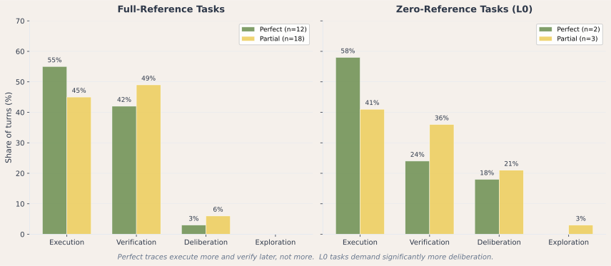
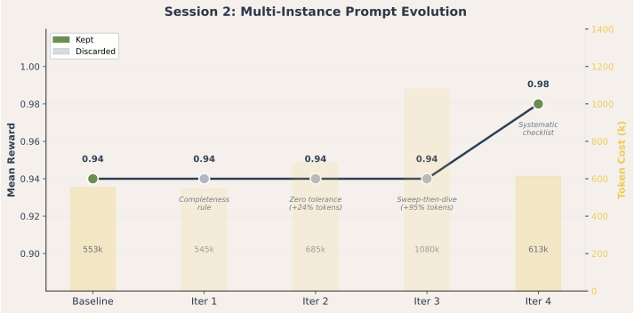
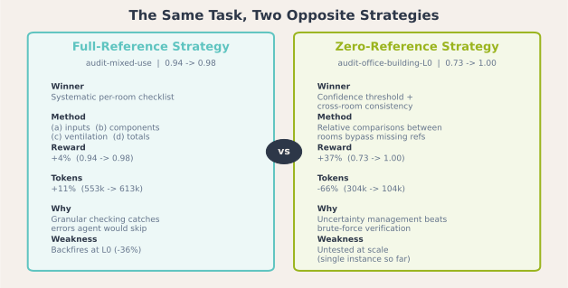
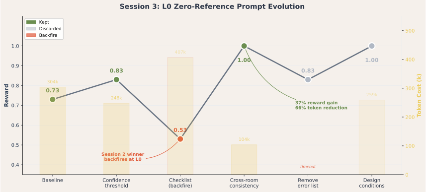
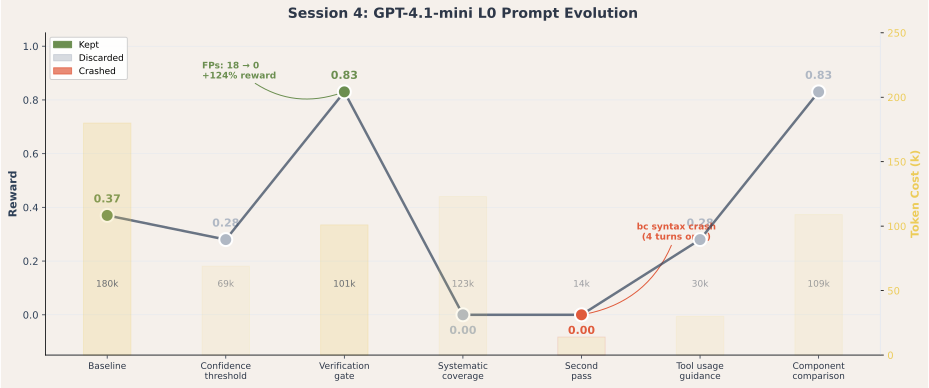
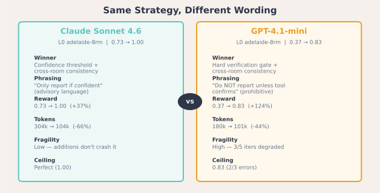
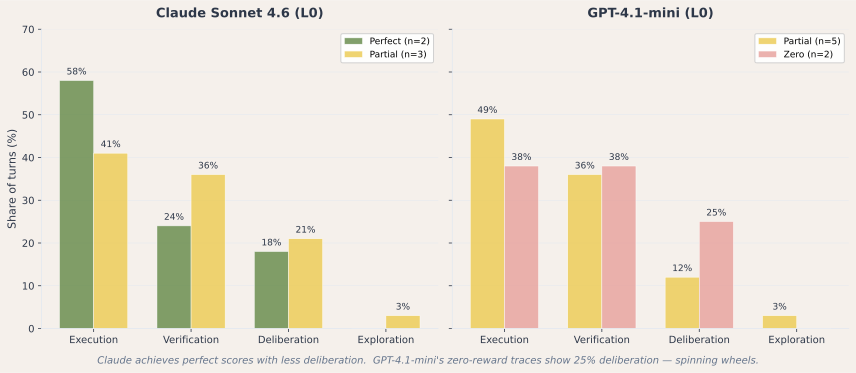

Estimated reading time: 25 minutes

About a week ago, Andrej Karpathy released [autoresearch](https://github.com/karpathy/autoresearch): a system where an LLM agent improves a model training pipeline overnight. The agent edits code, trains for five minutes, checks whether the result improved, and keeps or discards the change. Over roughly 700 experiments, it found around 20 real improvements and cut GPT-2 training time by 11%.

The design is compact: one markdown file, one editable target (`train.py`), one metric (`val_bpb`), and a greedy keep-or-revert loop.

**But training code is not the only thing that determines how well an AI system performs.**

In [Where Capability Actually Lives in Agentic Engineering](/blog/where-capability-actually-lives-in-agentic-engineering/), I argued that in domain-specific work, performance is distributed across the whole system: model, tools, prompts, verification, and output contracts. In [Benchmarking Agents on Real Engineering Work](/blog/benchmarking-agents-on-real-engineering-work/), initial results supported that claim. When workflow support was removed, capability did not degrade gracefully. It collapsed.

That finding raises a question this article tries to answer: **if the environment around the model carries a meaningful share of the capability, can part of that environment begin improving itself?**

> If the operating environment carries capability, then improving the environment is improving the capability. And if the improvement loop can be automated, it compounds.

This article applies that pattern to only one part of an engineering evaluation harness: the system prompt that guides audit behaviour. It lays out the design, reports four early experiment blocks on HVAC audit tasks, and examines what this kind of recursive improvement actually surfaces.

## TL;DR

- We applied the autoresearch pattern to one surface of our harness: the system prompt that guides audit behaviour.
- The system uses an information barrier so the autoresearcher agent sees patterns in outcomes, not task answers.
- Behavioural feedback from an agentic-bonds classifier gives a richer signal than reward alone by showing how the agent distributed effort across execution, deliberation, exploration, and verification.
- Across the Claude full-reference runs, one prompt change improved mean reward from 0.94 to 0.98 across five task instances. The entire change was two sentences: an explicit per-room verification checklist.
- On Claude at `L0`, that full-reference winner backfired. Confidence thresholds and cross-room consistency instead improved reward from 0.73 to 1.0 on one instance.
- On GPT-4.1-mini at `L0`, the same high-level strategy transferred, but the wording had to become a hard verification gate, and the model still topped out at 0.83.
- For Claude, perfect runs were *more* execution-heavy and *less* verification-heavy than partial ones. The difference was timing, not quantity: the strongest runs executed first and verified later in concentrated blocks.
- The main lesson is conditional. Prompt strategy depends both on the information available and on the model receiving the prompt.

## Why Autoresearch Works

Karpathy's design works because it fixes the evaluation loop into a form that can run unattended.

- **Fixed time budget.** Every experiment runs for exactly five minutes. Scores are comparable because improvements cannot hide behind longer training.
- **Single artefact.** The agent edits one file. That constrains the search space and keeps diffs reviewable.
- **Binary keep/discard.** The metric improved or it did not. No subjective judgement required.
- **Git as memory.** Every experiment is a commit, so the branch tip stays at the best known configuration.

As [Delip Rao's prompt anatomy](https://delip.github.io/mini-apps/annotated-autoresearch/) notes, `program.md` is not a loose prompt but an operating procedure: context, constraints, target, audit trail, loop, and safety valves. That is why the system works.

As [Philipp Schmid](https://www.philschmid.de/autoresearch) notes, when experiments run far faster than a human can manage, the bottleneck becomes the evaluation system. If the harness is a bottleneck, improving the harness becomes a high-leverage move.

## Why Engineering Harnesses Are Different

Translating the autoresearch pattern to engineering harnesses requires three design changes.

### The information barrier

In autoresearch, the autoresearcher agent sees everything: full training logs, exact loss curves, model weights. In our case, the artefact is a system prompt. If the autoresearcher could see the task content or planted errors, it could bake that knowledge into the prompt and overfit the benchmark.

So we need an information barrier between raw trial outputs and the autoresearcher. The autoresearcher sees *patterns* — "3 of the last 5 runs had incomplete coverage" — but never *answers*. That is the key structural difference from autoresearch.

### More Than One Score

Autoresearch has one scalar: `val_bpb`. Engineering harnesses need more. A score of 0.7 could mean missed findings, formatting errors, or a timeout. The autoresearcher needs to know not just how well the agent scored, but *how it behaved*.

We address this with three feedback channels:

- **Reward** — a float between 0.0 and 1.0 produced by a deterministic verifier that scores how completely and correctly the agent completed the audit task.
- **Failure categories** — abstracted failure modes without task-specific details: `incomplete_coverage`, `incorrect_values`, `format_error`, `timeout`, `false_positives`, `clean_miss`.
- **Behavioural profile** — a classification of each turn in the trace using our [agentic-bonds classifier](https://arxiv.org/abs/2601.06002). It labels turns as execution, deliberation, exploration, or verification, and returns the distribution, temporal sequence, and a short narrative summary.

That gives the autoresearcher more than a score drop. It can tell whether the agent stopped verifying, front-loaded execution, or spent too long deliberating.

### The Target Is the Workflow Prompt

Autoresearch optimises model architecture and hyperparameters. The artefact is code that defines how a neural network trains. In our case, the artefact is a system prompt: workflow instructions for audit work. It changes how the agent works, not what it knows. Prompts were the easiest surface to start with: easy to isolate, easy to diff, and easy to evaluate. As the harness becomes more structured, other surfaces like task generation, scoring rubrics, and tool workflows become plausible optimisation targets too.

This is closer to optimising an organisation's operating procedure than to optimising code. The question is not "what parameters produce the lowest loss?" but "what workflow instructions produce the most reliable engineering review?"

## The Design

The system has three layers with a strict information flow.


- **The autoresearcher agent** runs locally, driven by Claude Code following a `program.md` — the same pattern as autoresearch. It edits system prompts, makes git commits, reads sanitised feedback, and decides whether to keep or revert each change. It never sees task content, verifier code, or raw conversation transcripts.
- **Support scripts** handle the structured mechanics. `run_experiment.py` triggers a Harbor job in a Docker sandbox with the current system prompt. `feedback.py` enforces the information barrier: it reads the raw trial outputs, strips task-specific content, runs the bonds classifier, and returns a sanitised JSON summary. `results.py` manages the TSV audit trail.
- **The experiment sandbox** is unchanged from the existing evaluation harness — the same Docker containers, agents, verifiers, and output contracts used in the benchmark work from the previous article. The only thing that changes between iterations is the system prompt file mounted into the container.

The loop mirrors autoresearch exactly:

1. Edit the system prompt
2. Git commit
3. Run experiment in sandbox
4. Read sanitised feedback
5. Keep if reward improved, revert if not
6. Repeat

The `program.md` is organised into eleven sections: purpose, setup, scope constraints, artefact definition, experiment execution, feedback reading, optimisation targets, the loop itself, logging, autonomy mandate, and information discipline. The information discipline section is the one that has no analogue in Karpathy's version: it explicitly instructs the autoresearcher not to attempt reading task files or verifier code, and frames any desire to know specific task details as a signal to focus on process guidance instead.

## What Behavioural Feedback Adds

The agentic-bonds classifier gives the autoresearcher something autoresearch does not have: a temporal view of how the agent distributed its effort across the trace.

Each assistant turn in the conversation trace is classified as one of four types:

- **Execution** — doing the obvious next step: calling tools, formatting output, writing results
- **Deliberation** — committed reasoning about *how* to solve a problem, step by step
- **Exploration** — comparing alternatives, deciding *what* to do
- **Verification** — checking backward at its own work, comparing results against expectations

The autoresearcher sees this at three levels: the **bond profile** (distribution), the **bond sequence** (temporal pattern), and a short **bond narrative**.

### What the classifier actually found

We classified all 30 Claude Sonnet 4.6 traces from these runs — 12 perfect (reward 1.0) and 18 partial (reward 0.9). The classifier should be read as a behavioural lens rather than ground truth about cognition, but even on that basis the headline finding was counterintuitive.



**Perfect traces are more execution-heavy, not more verification-heavy.**

| | Execution | Verification | Deliberation |
| --- | --- | --- | --- |
| **Perfect (1.0)** | 55.5% | 41.9% | 2.6% |
| **Partial (0.9)** | 45.3% | 49.0% | 5.8% |

Exploration was effectively absent in this set of traces, which is why it does not appear as a meaningful part of the comparison.

The agents that scored perfectly spent *less* time verifying than the ones that missed an error. The execution-to-verification ratio shows the same pattern: 1.71 for perfect traces versus 1.06 for partial ones. This does not mean verification is unhelpful. It means badly timed verification correlates with worse performance.

Other patterns we see in the data:
- **Perfect traces execute first, verify later.** In the first half of the trace, perfect agents spent only 28% of turns on verification, compared to 41% for partial agents. By the second half, both groups converged around 55%. Perfect agents front-loaded decisive execution, then verified in concentrated blocks. Partial agents hedged earlier — which appears to reflect uncertainty rather than thoroughness.
- **Perfect traces build momentum.** The average longest uninterrupted execution streak was 3.8 turns for perfect traces, compared to 2.4 for partial. Perfect agents commit to a direction and sustain it. Partial agents interrupt themselves to verify before they have built enough context for verification to be useful.
- **Deliberation correlates with imperfection.** Only 25% of perfect traces contained any deliberation turns, compared to 56% of partial traces. When the agent pauses to reason about *how* to proceed, it is more likely to miss something. This suggests that deliberation in these traces signals uncertainty or confusion, not carefulness.
- **Start patterns diverge.** 58% of perfect traces opened with three consecutive execution turns (`exec | exec | exec`). Only 28% of partial traces did the same — most interrupted with verification or deliberation by the third turn.

### What this means for prompt design

The behavioural data sharpens the prompt improvement story. The successful change — adding a systematic checklist `(a) inputs, (b) components, (c) ventilation, (d) totals` — did not add verification. It structured the execution phase so the agent could work systematically before verifying.

In other words, the checklist made the agent behave more like the perfect traces already did: decisive execution, then concentrated verification.

## Early Results

We ran four experiment blocks on the system prompt that guides HVAC schedule audit tasks. One established the single-instance trap, one found a prompt improvement across five full-reference instances, one showed that the best strategy changes at `L0`, and one repeated the `L0` setup on a weaker model.

### Claude on One Full-Reference Task

The first Claude Sonnet 4.6 run tested five prompt modifications against a single task instance (adelaide-15rm). The baseline scored 0.9 — four of five planted errors detected.

Five strategies were tried: a planning step, cascade-error reporting, field-by-field verification, larger batches, and a re-verification pass. None moved the reward.

The autoresearcher reasonably concluded that the fifth error looked like a model capability boundary rather than a prompt issue. The one useful finding was about efficiency: the larger-batch approach achieved the same accuracy with fewer turns and tokens — 9 turns and 98k tokens versus the baseline's 10 turns and 105k.

**That conclusion turned out to be wrong.** Not because the reasoning was poor, but because the evidence was insufficient. Single-instance evaluation made a task-specific ceiling look like a universal one.

### Claude on Five Full-Reference Tasks

The second Claude Sonnet 4.6 run tested four modifications against five instances simultaneously (Adelaide, Brisbane, Darwin, Melbourne, Perth). The baseline mean reward was 0.94: three instances at 0.9 and two at 1.0.



Three approaches failed:
- **Iteration 1** added a completeness rule: "verify every room, do not skip rooms, a missed error costs more than an extra turn." No reward change. The instruction was redundant.
- **Iteration 2** added zero tolerance for numerical mismatches: "report ANY difference, do not dismiss as rounding." No reward change, but efficiency degraded sharply — 64 turns and 685k tokens versus the baseline's 52 turns and 553k. The agent re-checked more and found nothing new.
- **Iteration 3** restructured the workflow to a two-pass approach: sweep all totals first, then deep-dive flagged rooms. No reward improvement, and efficiency nearly doubled — 79 turns and 1.08 million tokens. It mostly shuffled which errors were caught without improving overall coverage.

**Iteration 4 worked.** The change was small: two sentences extended. The orient step added design conditions. The verify step added an explicit per-room checklist: (a) input parameters, (b) each heat gain component, (c) ventilation terms, (d) totals. Mean reward rose from 0.94 to 0.98. Adelaide and Melbourne both jumped from 0.9 to 1.0. Only Darwin remained at 0.9. The efficiency cost was modest: 55 turns and 613k tokens, an 11% increase over baseline.

Here is the actual diff — the entire improvement:

```diff
-1. **Orient (1 turn):** Read the schedule and identify the number of rooms
-   and available tools. Count your rooms — this determines your turn budget.
-2. **Verify (1 turn per 2-3 rooms):** For each batch of rooms, call the
-   calculation tool, then compare results against the schedule values.
-   Note discrepancies immediately.
+1. **Orient (1 turn):** Read the schedule and identify the number of rooms
+   and available tools. Count your rooms — this determines your turn budget.
+   Before proceeding, note the design conditions: outdoor temperature,
+   humidity, and any building-level parameters.
+2. **Verify (1 turn per 2-3 rooms):** For each batch of rooms, call the
+   calculation tool, then compare results against the schedule values.
+   For each room, systematically check: (a) input parameters (occupancy,
+   area, volume), (b) each heat gain component, (c) ventilation terms,
+   (d) totals. Note discrepancies immediately.
```

The improvement came from making an implicit checking procedure explicit.

### What the failed approaches have in common

The three failed approaches all tried to **add more work**. The successful one **structured the existing work differently**.

| Iteration | Approach | Reward | Token cost vs baseline |
| --------- | -------- | ------ | -------------------- |
| Baseline | — | 0.94 | — |
| 1 | Add completeness rule | 0.94 | -1% |
| 2 | Zero tolerance | 0.94 | +24% |
| 3 | Two-pass restructure | 0.94 | +95% |
| **4** | **Systematic checklist** | **0.98** | **+11%** |

That pattern — structure matters more than volume — echoes the previous article's result that the strongest models did not simply verify more; they verified as part of a structured workflow.



### Claude at L0

The Claude `L0` run targeted the hardest reference level: `audit-office-building-L0`. Here the agent receives only room type, floor area, ceiling height, and location. It does not receive design conditions, formulas, or lookup tables. The prompt is operating in a much thinner information environment.

The baseline reward on the Adelaide `L0` instance was 0.73. The agent found 2 of 3 issues, but it also produced false positives.



The first useful change was not a better checking procedure. It was a confidence threshold: **only report an error if the model can identify the specific assumption, parameter, or formula that appears to be wrong**. That lifted reward from 0.73 to 0.83 by eliminating false positives.

The next result was the important one. The full-reference winner — the systematic per-room checklist — did not generalise. It backfired. Reward dropped from 0.83 to 0.53, and false positives returned. At full-reference levels, granular checks help because the agent can anchor them against formulas and tables. At `L0`, the same granularity forces the agent to compare schedule values against assumptions it is partly reconstructing from memory.

The winning change was different in kind. Adding a cross-room consistency rule — compare similar rooms against one another and investigate large relative differences — lifted reward from 0.83 to 1.0 on this instance, while also reducing token usage sharply.

That is a strong result, but it is still single-instance. It shows that the strategy can change sharply when reference material is removed. It does not yet prove that we have the generally best `L0` prompt.

What it does show is that prompt optimisation is reference-level-specific. At high reference levels, the prompt benefited from explicit granular verification. At `L0`, the better strategy was uncertainty management plus relative comparison.

| L0 Iteration | Strategy | Reward | Tokens In | Outcome |
| --- | --- | --- | --- | --- |
| Baseline | Original prompt | 0.73 | 304k | 2/3 findings + false positives |
| 1 | Confidence threshold | 0.83 | 248k | False positives removed |
| 2 | Systematic checklist | 0.53 | 407k | Backfired |
| 3 | Cross-room consistency | 1.00 | 104k | 3/3 findings, no false positives |
| 5 | Add design-conditions note | 1.00 | 258k | Same reward, worse efficiency |

### GPT-4.1-mini at L0

The GPT-4.1-mini `L0` run repeated the same task on the weakest model from the earlier benchmark. The baseline was much worse than Claude's: reward 0.37, only 1 of 3 planted errors found, and 18 false positives.



What transferred was the strategy, not the exact wording. The soft confidence-threshold language that helped Claude did not work here. But once **the instruction was rewritten as a hard verification gate** — do not report a discrepancy unless the tool confirms it — false positives disappeared and reward jumped to 0.83.

That shows two things at once. First, the underlying prompt idea generalises across model families: reduce unsupported claims, rely on internal consistency, and force the model to ground discrepancies. Second, the wording still has to match the model's instruction-following style.

The ceiling also remained model-specific. GPT-4.1-mini improved dramatically, but it did not reach Claude's `L0` result. The best run found 2 of 3 issues with no false positives.



| Model | Baseline | Best | Winning strategy | Constraint style |
| --- | --- | --- | --- | --- |
| Claude Sonnet 4.6 | 0.73 | 1.00 | Confidence threshold + cross-room consistency | Advisory |
| GPT-4.1-mini | 0.37 | 0.83 | Verification gate + cross-room consistency | Prohibitive |

The early behavioural picture suggests the two wins differ not only in wording, but also in how the models stabilise. Claude's successful `L0` run remained relatively execution-compatible. GPT-4.1-mini's best run was much more verification-heavy.

## What the Results Suggest

### Self-improving harnesses are feasible

The system worked. The autoresearcher agent formed hypotheses from sanitised feedback, made targeted prompt changes, measured their effect, and advanced the branch when something improved. The information barrier appeared to hold, and some improvements generalised across instances.

This is obviously a small result, but it validates the basic mechanism.

### The environment is improvable, not just measurable

The previous two articles established that the operating environment carries capability and that this dependence is measurable. This article adds a narrower claim: at least one important part of that environment, the workflow prompt, is improvable through automated search. **If harness improvement can be partially automated, investment in evaluation infrastructure compounds**.

### Single-instance evaluation misleads

The single-instance Claude run concluded that the reward ceiling was a model capability boundary. The five-instance Claude run proved that wrong. The ceiling was instance-specific. Multi-instance evaluation was necessary to discover that the prompt could improve, and which prompt changes actually generalised.

This point travels beyond this setup. Evaluating on a single test case can make genuine improvement opportunities look like hard limits.

### Structure beats volume

The most expensive failed approach cost nearly twice the baseline in tokens and produced no improvement. The successful approach cost 11% more and raised reward by 4 percentage points. It is possible that, in engineering review work, telling an agent *how* to check is more effective than telling it to check *more*.

That said, the Claude `L0` run adds an important qualifier. The right structure depends on the reference level. On full-reference tasks, structure meant explicit component-by-component verification. On `L0`, structure meant constraining when the agent should trust its own judgement and shifting toward relative comparisons inside the schedule itself.

### Prompt optimisation is reference-level-specific

The `L0` run is the strongest evidence in the whole set that there may be no single best workflow prompt. The same checklist that helped at full reference actively hurt at `L0`. Removing reference material changed what kind of prompt guidance was useful.

That suggests a more general rule: prompt quality is conditional on information availability. A prompt that works well when the environment supplies formulas, tables, and design conditions may fail when the model has to reconstruct too much of that context from memory.

### Strategy transfers across models, wording does not

The GPT-4.1-mini run adds a second qualifier. The high-level idea that worked at `L0` transferred across model families: suppress unsupported discrepancies and use relative comparisons when absolute references are weak. But the wording had to change. GPT-4.1-mini did not respond reliably to soft advisory language. It improved only when the same idea was expressed as a hard gate.

That suggests prompt portability has two layers. Strategy may travel. Surface phrasing may not. It also suggests that prompt optimisation has a ceiling. GPT-4.1-mini improved much more in relative terms than Claude, but it still stopped well short of Claude's absolute result.



### Behavioural analysis inverted our assumptions

Before classifying the traces, we assumed that more verification would correlate with better performance. The data showed the opposite: perfect traces were execution-dominant, while partial traces were roughly balanced. The goal is not to maximise verification. It is to make execution decisive enough that verification can happen in concentrated blocks rather than as reactive interruptions.

## Honest Limitations

This is early work. The scope is narrow and the results are preliminary.

- **Single task type, single domain.** All experiments targeted HVAC audit tasks. We do not know whether the checklist approach generalises to other engineering task types.
- **Small iteration count.** Four experiment blocks are enough to validate the mechanism and expose two important conditionalities, but not enough to map the full improvement frontier.
- **Bonds data is still thin outside the Claude run and has no human-annotated validation set here.** The 30-trace behavioural analysis is for Claude Sonnet 4.6 on one task family. The GPT-4.1-mini read is directionally useful, but much smaller.
- **The information barrier is untested against adversarial pressure.** The autoresearcher followed the information discipline in these runs, but we have not stress-tested whether a sufficiently capable autoresearcher agent might infer task-specific content from the feedback patterns.
- **The `L0` result is still single-instance.** The 1.0 score is encouraging, and it was reproduced once with a slightly more expensive prompt variant, but we have not yet tested the `L0`-optimised prompt across multiple cities. The five-instance Claude run already showed how misleading single-instance conclusions can be.
- **The GPT-4.1-mini comparison is also single-instance.** We do not yet know whether the 0.83 ceiling or the prompt fragility pattern will hold across other cities or adjacent task families.
- **Darwin remains at 0.9.** One instance did not improve across any prompt change. This may be a genuine model capability limit for that specific error type, but we would need to break the information barrier to investigate.
- **Stochastic variance is bounded but real.** Iteration 3 showed Brisbane and Melbourne swapping scores, suggesting approximately 5-10% variance per instance. Larger sample sizes would help distinguish signal from noise.

## What Comes Next

The system currently optimises one surface: system prompts. Two obvious new surfaces remain:

- **Task generation** — using the loop to generate new task instances that produce useful signal.
- **Scoring rubrics** — iterating on how agent output is evaluated, especially for tasks with qualitative judgement.

The prompt surface itself can also become more adaptive:

- **Level-adaptive prompts** — switching workflow strategy based on how much reference material is available. The contrast between the five-instance full-reference Claude run and the Claude `L0` run suggests that prompt selection may need to be conditional rather than global.
- **Model-adaptive prompts** — varying the instruction style as well as the workflow strategy. The GPT-4.1-mini run suggests that the same conceptual rule may need different wording for different models.

The longer-term question is whether prompts, tasks, and rubrics can be improved jointly. That is where recursive harness improvement starts to look more like a research programme.

For now, the result is small and specific: an autonomous loop, an information barrier, behavioural feedback that inverted our assumptions about verification, one prompt change that helped at full reference, another that worked for a very different reason at `L0`, and a cross-model comparison showing that prompt ideas can transfer even when prompt wording does not. The environment was improvable in each case, but the successful strategy depended on what information the environment already supplied and which model was inside it. The agents that scored best were not simply the ones that checked the most. They were the ones whose workflow matched the structure of the task, the information available, and the model's own behavioural constraints.

That, at least, is consistent with everything we have been learning about where capability actually lives.
